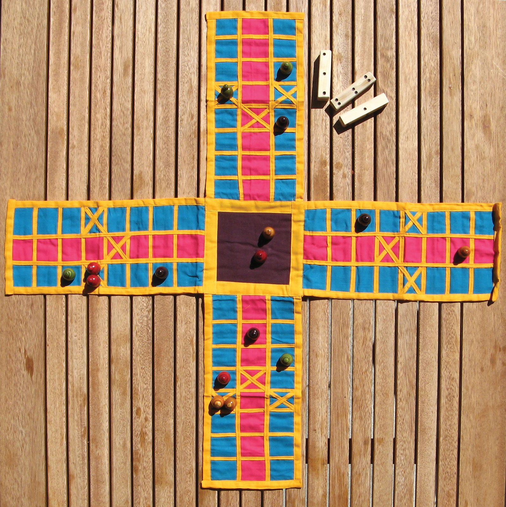

# History and Evolution of Ludo
Ludo is a classic board game that has entertained people for generations and has been a beloved pastime for many. Its simple and engaging gameplay has made it a major part of homes and social gatherings all over the world. While the base of most Ludo board games's gameplay is similar to each other, the design of the Ludo boards and pieces has evolved significantly over the years as per the changes in culture, design preferences, and technology.

    

### The Origin of Ludo
Ludo's roots can be traced back to ancient India, where it was known as ***"Pachisi"***. This board Ludo game, *Pachisi* was originally played on a **cloth or wooden board, and the players used cowrie shells as dice and miniature figures or seeds as game pieces, also known as *gotis***. The board design was simple, with a **cross-shaped path and a center square**, and the objective of the game was for you to move all your pieces from the outer squares to the center before your opponents.

***Pachisi*** was a highly popular game in *India*, and as time changed, its popularity increased. Within time, it was adopted by the Mughal Emperors of India and was then modernized with a **few changes in the pieces and became known as "***Chaupar***". The ***Chaupar*** game, while very similar to that of ***Pachisi*** but instead of cowrie shells was played with 3 four-sided long dice*.

| Pachisi | Chaupar |
| :---: | :---: |
|  |  |

### The British Influence
With the arrival of the *British colonial period*, the ***Pachisi*** game made its way to *England*, where it **underwent a transformation in ludo board game design and rules**. It was rebranded as "***Ludo***," derived from the *Latin* word for "***I play***," by Alfred Collier, and became a popular game among the British elite. The **game's design was altered from the original design of the game board to include a square board divided into a grid of smaller squares and the *traditional Indian cowrie* shells were replaced with *cubed dice***.

### The Modern Ludo Board
Today's Ludo board design is a testament to the game's enduring popularity. The **game board consists of a *large square divided into four different colored quadrants***, with each quadrant featuring a circuitous path leading to a **central end zone**. The design is both visually appealing by being colorful and engaging and functional by being easily understandable and compatible with the Ludo rules, with clear distinctions between the different colored zones to prevent any confusion for players playing the Ludo game.

| Early British | Modern |
| :---: | :---: |
|  |  |

### The Digital Era of the Ludo Board Game
As the popularity of the Ludo game seems prosperous and never-ending, it has made a seamless transition into the digital realm in the age of smartphones and tablets. Mobile apps and online platforms offer players the opportunity to enjoy the game virtually, connecting with friends and family from around the world. While the core gameplay remains the same, the digital versions often feature animated pieces and interactive elements that add a new dimension to the experience.
One of the leading digital Ludo platforms in India is Ludo Empire. Ludo Empire is a Ludo board game online game where players can enjoy the traditional game of Ludo with players all across India and win real money as an added bonus. The game is similar to that of the original Ludo, consisting of a square board with four different colored tokens, in the shape of pawns and one single dice. Its easy gameplay, colorful attributes, multiple modes, and the ability to win huge cash prizes with only a small entry by using their Ludo strategies and skills are what have made it so popular with the players of the Ludo board online game.

| Web Game | Mobile (6 players) | Mobile (4 players) |
| :---: | :---: | :---: |
|  |  |  |

### Resources / References: 
- [Origin of Ludo](https://ludoempire.com/blog/origin-of-ludo)
- [Ancient Board Games, History, Origin, and Evolution of Ludo](https://ludoplayers.com/blog/ancient-board-games-history-origin)
- [The Design and Evolution of Ludo Game Boards and Pieces](https://ludoempire.com/blog/the-design-and-evolution-of-ludo-game-boards-and-pieces/)
- [Images Used in This Document](/resources/ludo-history-research/)