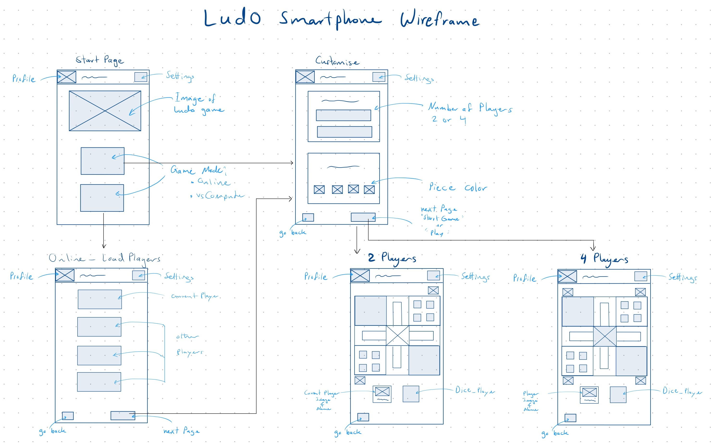
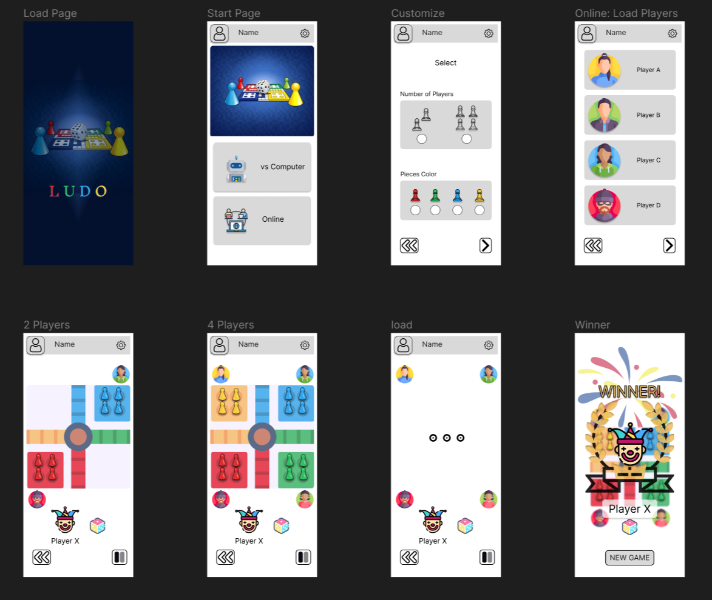
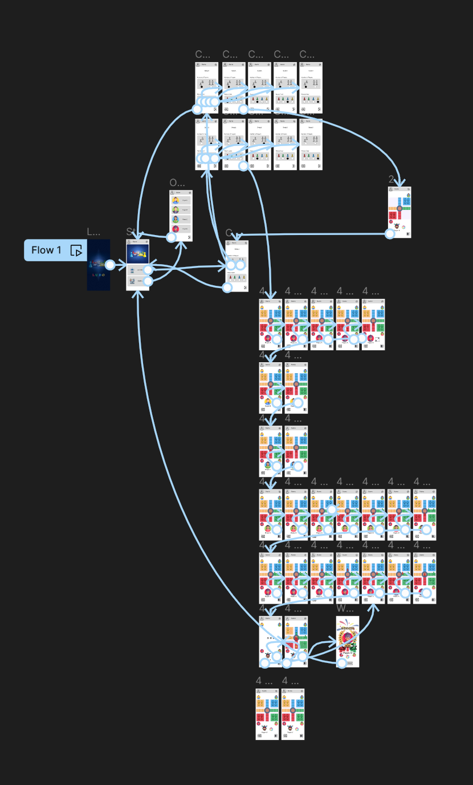
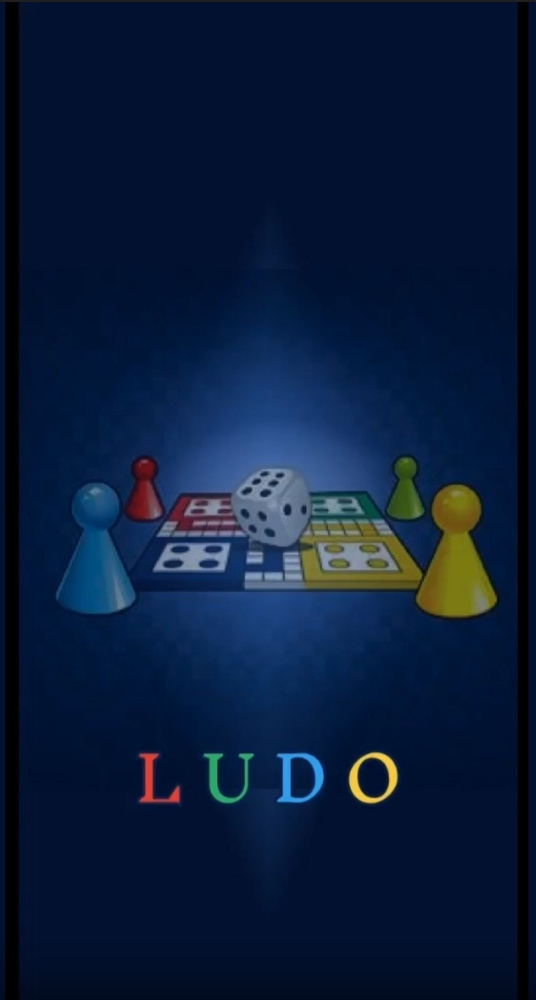

# Ludo Interactive Prototype Design

**Goal**: Create a modern looking mobile Ludo game using Figma

---

### Wireframe

    

 

- **Medium**: iPad
- **Representation**: 
  - Text : `~~~~~` 
  - Images : `|X|`
  - Buttons : `| |`
  - Functions/Actions: is described in words (*light blue*)

---  

### Prototype 
| All screens (overview) | Interaction map (Figma) |
| :---: | :---: |
|  |  |

- For a closer look at the Figma files: visit the [prototype-figma](/designs/prototype-figma/) folder.
- The assets used in the prototype are available in the [assets-figma](/resources/assets-figma/) folder.

#### Short Demo of a Game Scenario

*A short interactive game scenario built in the free version of Figma — Player D wins.*

Note: GitHub does not support inline video playback, and this demo video (~9 MB) is too large to preview directly.

To watch the video: 👉 [Click here to download or open the demo video](../designs/prototype-figma/ludo-prototype-demo.mp4)

  Then in the upper-right corner of the opened video page `designs/prototype-figma/ludo-prototype-demo.mp4`, click the ••• menu and select "Download" if it doesn’t play in your browser.
    
The design logic by always clicking on the dice to change turns between players is only implemented to showcase the functionalities of the game. A fully realistic interactive prototype scenario wasn’t possible due to limitations in the free version of Figma.

---

## Resources
- Tools: [Figma](https://www.figma.com/)
- Images and icons: [Flaticon](https://www.flaticon.com/free-icon/fireworks_7882857?related_id=7882857)
- Inspiration: see [`history-of-ludo.md`](./history-of-ludo.md)