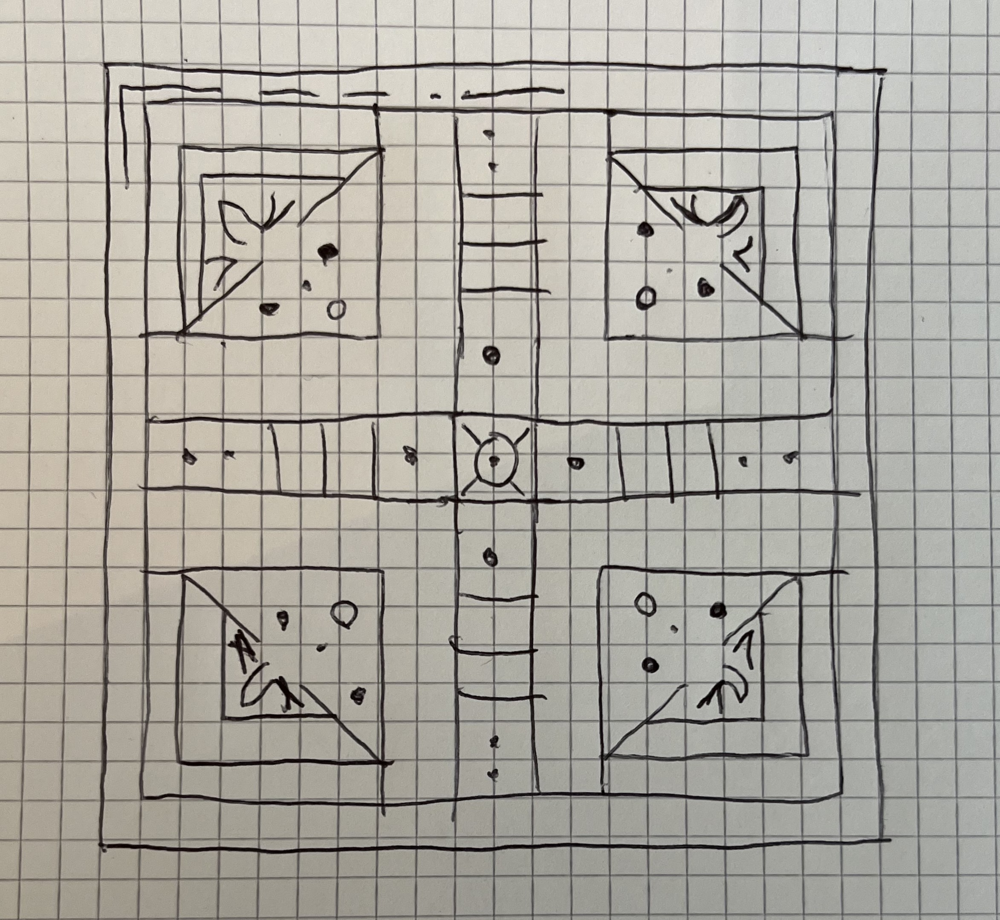
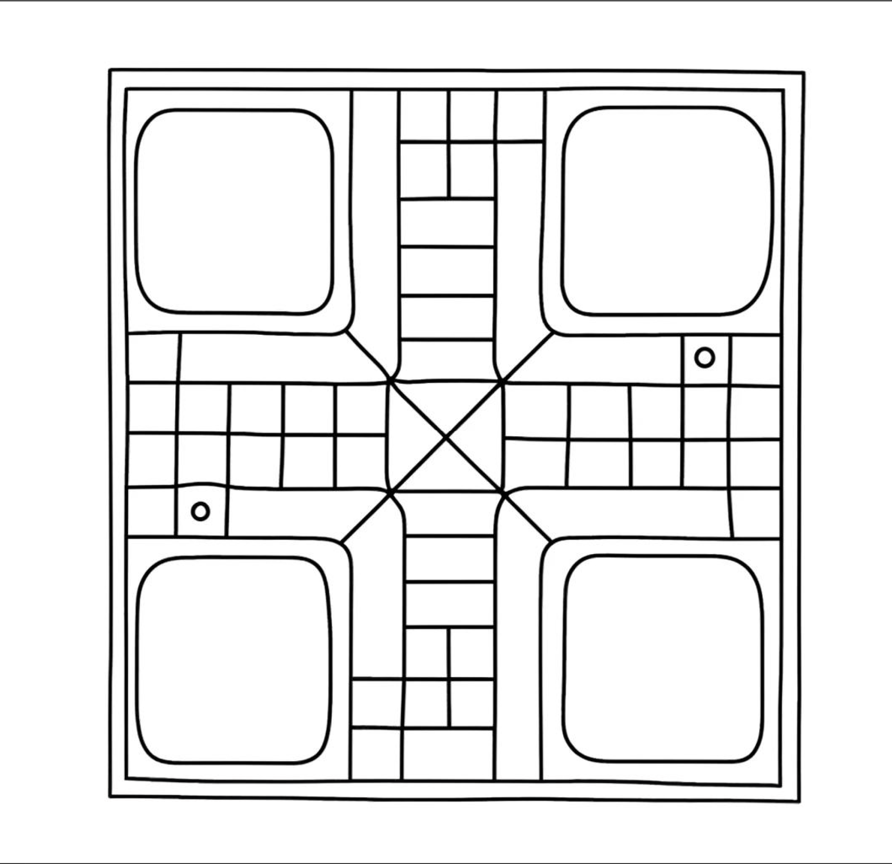
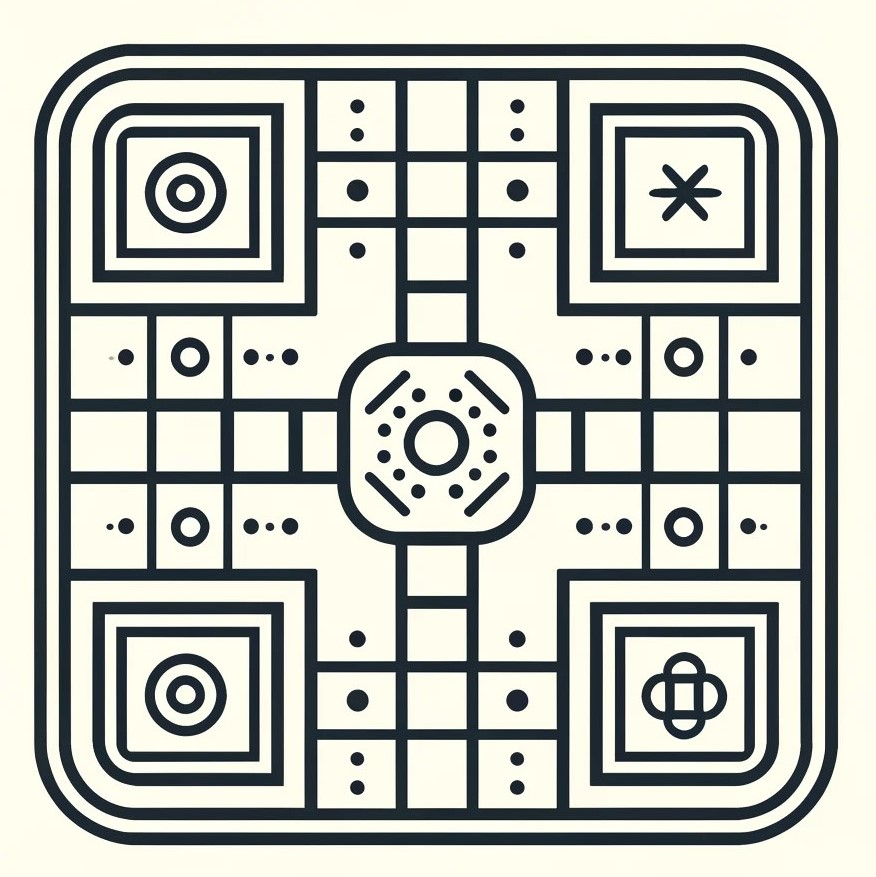

# Ludo Design & Sketches

### Idea 
- Desktop
  - Design: Ancient (Indian), Style: simple/ancient, Medium: Paper
  - Design: Modern (British), Style: Modern, Medium: Figma
- Smartphone
  - 3 above design for smartphones, Medium: iPad/draw.io
  - Will be realised in prototype: Modern (British), Style: Modern, Medium: Figma

### Sketches

#### Desktop
| Ancient (Indian) | Modern (British) |
| :---: | :---: |
|  |  |

#### Smartphone
| Old (Indian, Retro) | Modern (British) |
| :---: | :---: |
|  |  |

### Inspiration
- See research: [`history-of-ludo.md`](./history-of-ludo.md)